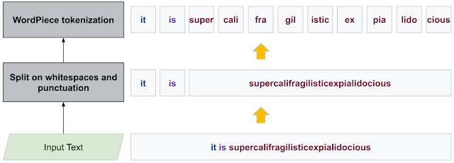
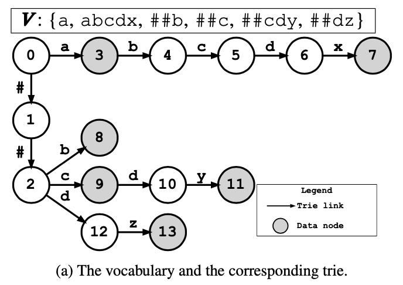
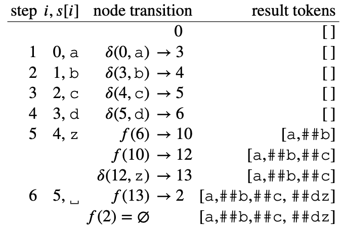
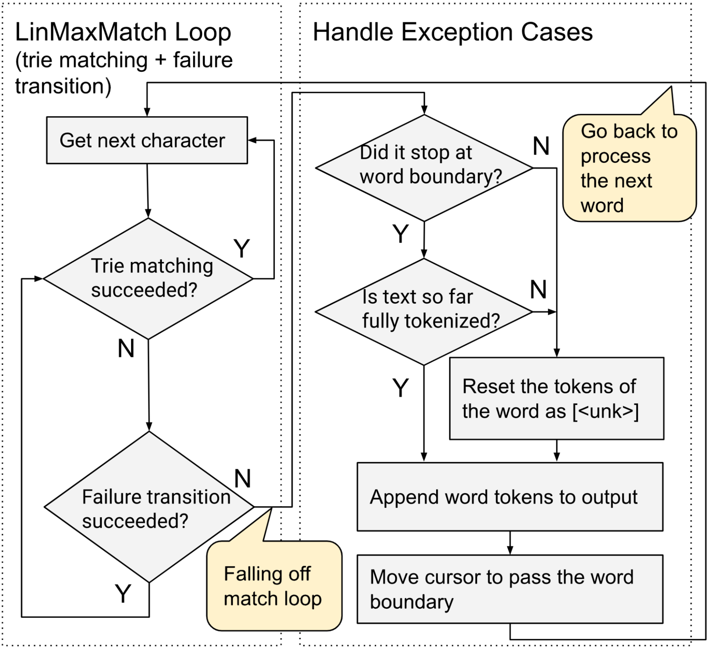

# Study Note: Fast WordPiece Tokenization

Paper: [Fast WordPiece Tokenization](https://arxiv.org/abs/2012.15524)

Website: [A Fast WordPiece Tokenization System](https://ai.googleblog.com/2021/12/a-fast-wordpiece-tokenization-system.html)

## overview

### Tokenization

用于ML中自然语言预处理。sentence转化为smaller Unit（word，或者word segment的更小块），然后进一步转化为embedding vector to fed a ML model；

一种基本分词方法是把语句分成单词（sentence to words），但是单词表中没有出现过的词就被对待为Unknown，（且单词表量巨大）；

现代NLP解决方案：把word拆分成更小的subword units（例如语素Morpheme）。这样做的优点是，即使这个单词或者词组是一个unknown的新词， subword units往往能够保留语言学上的含义

- `love, loves, loved, loving`
- `lov + [e, es, ed, ing]`

目前一种比较常见分分词tokenization（to subunits）方法：WordPiece

### WordPiece

concept：



作者在论文中，提出 [“Fast WordPiece Tokenization”](https://arxiv.org/abs/2012.15524)的分词方法；提升end-to-end的分词效率；


### Single-Word WordPiece Tokenization

#### Single-Word WordPiece Tokenization common方法：

- greedy longest-match-first strategy ->  [maximum matching](https://tm-town-nlp-resources.s3.amazonaws.com/ch2.pdf) or MaxMatch

```python
# https://blog.csdn.net/weixin_40322587/article/details/80877810

def max_match(language:str, text:str, vocabulary:list):
    n = len(text)
    if text == '':
        return []
    for i in range(n):
        first_token = text[:n-i]
        remainder = text[n-i:]
        if first_token in vocabulary:
            return [first_token] + max_match(language,text = remainder,vocabulary=vocabulary)
    # if no match
    if language == "zh":    # Chinese - return one-char
        first_token = text[0]
        remainder = text[1:]
    elif language == "en":     # English - return whole text
        first_token = text
        remainder = ""
    else:
        raise ValueError

    return [first_token]+max_match(language, remainder, vocabulary)

 # =======================
```

- WordPiece依赖于字典vocabulary质量；

- Complexity - `O(n*n)` - n = input word length

#### LinMaxMatch：作者提出的新方法

- Complexity - `O(n)`
- 引入两点改进
  - organize the vocabulary tokens in a [trie](https://en.wikipedia.org/wiki/Trie) - 字典树
  - failure transition
  - **organize the vocabulary tokens in a [trie](https://en.wikipedia.org/wiki/Trie) - 字典树**

 

- 把词典组织成字典树格式
  - naive approach例子：通过字典树寻找匹配，例如`abcdz`
    - 先匹配到`"a"`，继续顺着节点往下延伸，抵达node-6，发现无法继续匹配，result extend `['a']`;
    - remain `"bcdz"`, 继续匹配，抵达node-8，result extend `"##b"`; 
    - remain `"cdz"`， 继续匹配，抵达node-10，发现无法继续匹配，result extend `"##c"`;
    - remain `"dz"`, 继续匹配，抵达node-13，匹配完成，result extend `"##dz"`
    - 返回result`['a','##b','##c',##dz]`
  - Complexity O(nm)
    - n = input word length
    - m = trie depth
- 这个方法有个缺陷，如果一个node较深，在最后fail match；

**Failure Transition**

- 上述方法有优化的空间：
  - inspired by Aho-Corasick algorithm
  - 当我们已经match了`abcd`，但是发现`z`无法match，需要从头开始match
  - 但是当如果我们观察trie结构，能知道str: `abcd`能够直接返回并append `['a','##b']`
  - 可以直接跳到步骤：remain`"cdz"`，这里就省去了重复match `b`的步骤

- 通过对字典树的预计算precoumpute，我们可以得到figure—1的table。
  - 通过这个table，即使search到了较深的node但没有match，也可以返回相对应的结果并跳转到新的node继续search
  - 例子`abcdz`

 

### End-to-End WordPiece Tokenization

- 现有（旧有）方法
  - step#1: 预分词，pre-tokenization，通过标点punctuation或者空格whitespace把句子分成list of words
  - step#2: 然后使用WordPiece来把single word单词split into sub-units
- End-to-End新方法：只用遍历整体text一遍
  - 减少标点punctuation或者空格whitespace的check
  - 不需要生成中间层words list
- 方法：
  - 核心思想就是结合使用trie matching 和failure link
  - 但是需要对precoumpute做些调整，增加对标点punctuation或者空格whitespace的处理
    - 用Vocabulary生成trie之后，先remove所有的punctuation char node
    - 对所有punctuation char，增加一个data node without descendant（终点node空集`[]`）
    - 如果这个punctuation char是Vocabulary中的一部分（例如所有格`Jack, "’", s`）则正常返回且无failure pops & links（无跳转）
    - 效果：单词中的punctuation，自己成为一个token，otherwise成为`<unk>`token



## Ref

### Time Complexity

算法耗时，标记算法效率

- Constant time – `O(1)`
- Linear time – `O(n)`
- Logarithmic time – `O(log n)`
  - The number of operations gets reduced as the input size increases. Algorithms with Logarithmic time complexity are found in binary trees or binary search functions. This involves the search of a given value in an array by splitting the array into two and starting searching in one split.
- Quadratic time – `O(n^2)`
  - Nested loop -> loop in loop
  - if `m` nested loops -> `O(n^m)`

### Vocabulary

the construction of the vocabulary is not covered in this paper, refer: [Google - Tensorflow](https://www.tensorflow.org/text) 
