# Metrics and methods for a systematic comparison of fairness-aware machine learning algorithms

## 目录

- 概述
- 1-简介
- 2-相关工作
- 3-公平性评价
- 4-实验准备设置
- 5-实验结果
- 6-讨论
- 7-总结

---

## 概述

- 实验内容：系统性比较目前各主流算法（fairness aware & unaware）的公平性表现
- 实验对象: supervised classification models
- 数据库：
  - 真实数据3组
  - 合成数据4组
- 考量指标：
  - fairness
  - predictive-performance
  - calibration quality
  - speed
- 小结：
  - fairness-unaware models：一般无法得出较为fair的结果
  - 最简单的算法（simplest model/algorithm）不一定是最fair的方法
  - fair aware model/algorithm能促进fairness并同时保持较好的模型预测能力
  - 数据本身（unfairness，correlation）能影响fairness-aware model的表现
- 实验目的：通过实验结果，在需要考虑fairness时，帮助快速选取更合适的模型算法

---

## 1-简介

- data with unknown bias -->(?) fair model
- Focuse: binary classification (simple binary protected attribute)
- introduce metric: ***fair efficiency***
- fair efficiency <<== fairness + performacne:
  - fairness
  - performance
- ***Fair feature selection***: selecting features taking both their predictive power and fairness into account

---

## 2-相关工作

- intervention：对模型的干预，用于增强fairness
- intervention类型：
  - Preprocessing-data数据预处理
  - post-processing of model outputs对模型输出结果处理
  - fairness constraints+model training模型训练过程干预

---

## 3-公平性的评测

- 数据结构：
  - S: {X,Y,Z}
    - X: features
    - Y: binary target lable
      - Y=0 [favourable outcome]
      - Y=1 [favourable outcome]
    - Z: binary protected attribute
      - Z=0 [unpriviliged]
      - Z=1 [priviliged]
- Algorithm A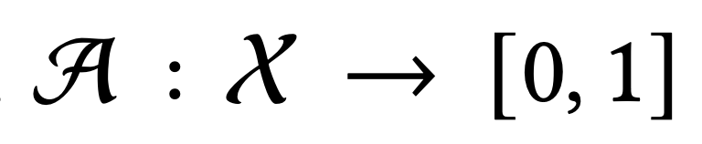
- Predicted score: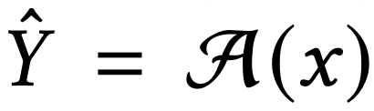
- threshold 𝜏 & indicator : 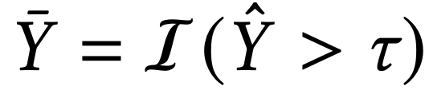
- **Algorithm A: may have a continuous or binary fairness parameter 𝜆 which trades off fairness and classification performance**
  - **𝜆 = 0:  no fairness intervention** 
  - **𝜆 = 1:  maximum fairness intervention** 
- predictive-performance metric: quantifying how well the output scores predict the true labels
- fairness metric: deter-mine how symmetric (i.e., unbiased or unprejudiced) the predicted labels are with respect to the protected attributes.
  - Equality of Opportunity (EO): 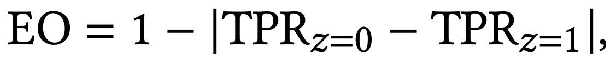
  - Disparate Impact (DI): 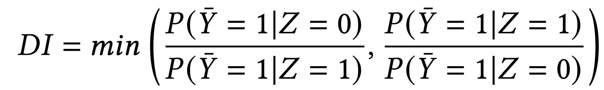
  - **Rule: DI value of less then 80% is taken as an indicator of unwarranted discrimination and initiates further in- vestigation (the “four-fifths rule”)**
- DI is not optimized directly [via: Statistical Parity Difference (SPD)]: 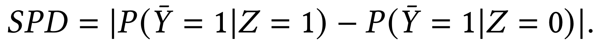

### 3.1-Fair efficiency

- helper integral 𝐾𝑚：
  - 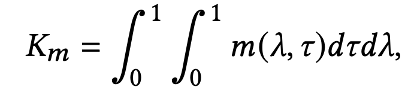
  - predictive-performance metric 𝑝
  - fairness metric 𝑓
  - fair efficiency Θ 【harmonic mean between 𝐾𝑝 and 𝐾𝑓 】
    - 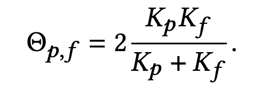
    - m

---

## 4-实验设置

- 模型算法选取标准：
  - open source
  - easy to adapt to std fit/predict API
  - Output continuous score
  - fairness intervention must be controlled by single
  - (only evaluate fairness interventions applied at pre-processing and training stage)
  - (not consider post)
- Benchmark (form performance benchmark):
  - **(Benchmark LR)** logistic regression
  - **(Benchmark BT)** Boosted Tree
  - **(Benchmark NB)** naive Bayes classifier
  - **(Benchmark SVM)** Support Vector Machines 
  - **(Benchmark RF)** random forests
  - **(Benchmark XGB)** XGBoost
  - **(Benchmark LGB)** LightGBM
- fairness preprocessing
  - **(Reweigher)** instance reweighing
  - **(DIRemover)** disparate impact remover
  - fair feature-selection method
- in-training fairness algorithms 
  - **(FR NN0001)** SPD- regularized neural networks
  - **(LagRed BT and LagRed LR)** Lagrange reduced boosted trees and logistic regression 
  - **(DI LR 1 and DI LR 2)** logistic regressions with fairness-constraint optimization

### 4.1-数据

- 3 real dataset:
  - titanic (泰坦尼克-生存)
  - the adult（社会背景-收入>50k）
  - the German（金融信息-credit default）
- 4 synthetic dataset：
  - **Simple - Direct (S-D)**: x无直接影响，z有直接影响y
  - **Simple - Proxy (S-P)**：z通过部分x变量影响
  - **Interactions - Direct (I-D)** z可直接影响y，收x变量影响（x为binary）
  - **Interactions - Proxy (I-P)**通过interaction影响部分x变量
  - 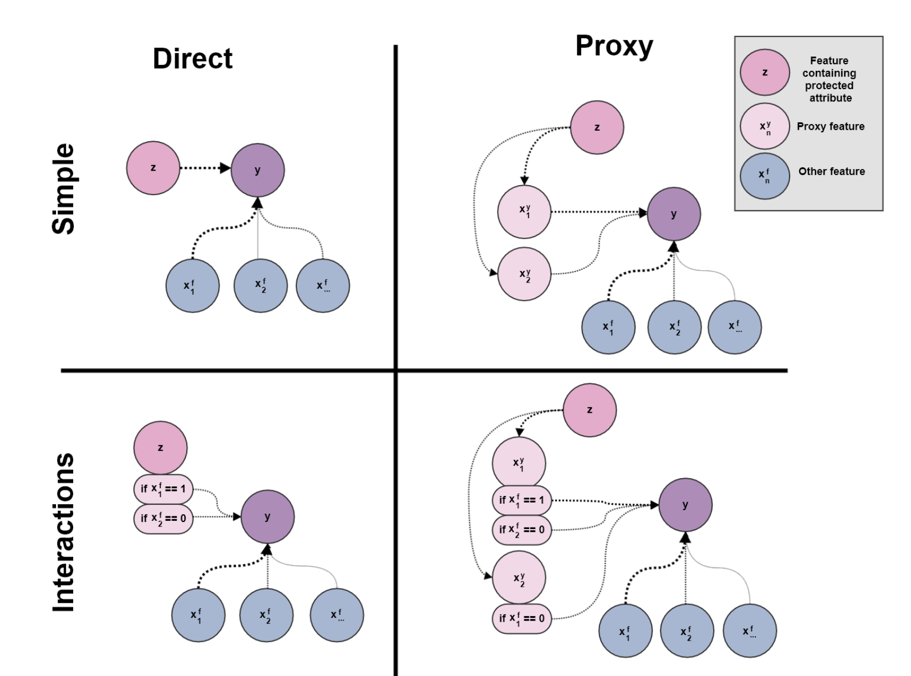

### 4.2-Methodology

- Argmax：统一使用threshhold = 0.5
- PPR: positive predictive rate (PPR) matches a pre-determined value of 20% within a fixed tolerance**(?)**
- Policy Free: all threshhold （使用fair effeciency matrix）
- Measure:
  - accuracy and precision: Argmax & PPR
  - AUC: fair efficiency: 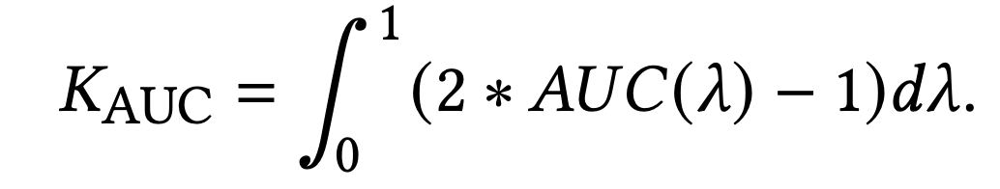
- Flow:
  - 1-get hyperparameters
  - 2-training
    - swift fair intervention [0,1]
    - 模型训练
  - 3-fairness比较：
    - threshold： swift from 0 to 1
    - 计算各组合下（predictive-performance & fairness metrics）
    - fair feature selection： 𝑘 = 8 or 12 features for **fit** a random forest model
- 在各个(𝜏, 𝜆)组合下，根据各个比较标准（条件），选取threshold：
  - Argmax=0.5
  - PPR（positive predictive rate）: find the smallest 𝜏 closest to the 20% target acceptance rate 
    - 【20%的标准怎么来的?】
  - Policy-Free approach: 所有的threshold都有考虑到
- 比较：
  - fairness preprocessing：【on、off】

---

## 5-结果

### 5.1 Argmax and PPR Policies

- Benhmark：
  - benchmark的predictive和fairness在不同的数据库中（同一个比较标准下）表现较为一致
  - benchmark的Disparate Impact（DI）表现不太好，大多数情况下未能满足80% DI threshold
  - （之前assume最简单的算法最fair）但是logistic regression不是最fair的算法
  - benchmark中SVM是相对最为fair的算法
- Preprocessing：
  - Applied之后，大多数case下，DIRemover & Reweighing 能有效提升DI值
  - 不同model提升效果差别较大
  - Argmax标准下提升效果比较稳定
  - PPR标准下提升效果有较大差异
  - 有不少结果仍然达不到DI > 0.8的标准（主要是PPR policy）
  - 与DI相反，大多数EO结果较好（>0.8）
  - **观测到：在优化fairness的同时，对于模型预测准确的降低（损失）较小**
- Overall performance：
  - 针对preprocessing 和 in-training fairness优化predictive（acc）和fariness（DI）
  - 较难找到一个threshhold在PPR或是argmax下，满足DI > 0.8的要求
  - Argmax policy：
    - fairness和accuracy没有明显的负相关性
    - 通过组合fairness intervention和模型，能在不牺牲acc的情况下最多提高0.3的DI
    - 总结所有的数据，总有一个intervention和模型的组合能到达DI>0.8的要求
    - 在满足DI>0.8的情况下，大多数为in-training fairness intervention算法的acc表现最好
    - benchmark通常较难达到DI>0.8的标准
    - 在提升DI的同时，通常会有牺牲acc，（0.02到0.13不等，会受到dataset的影响）
- 计算成本：
  - preprocessing interventions & benchmark models相对速度较快
  - 某些模型（e.g. DI LR 2）predictive和 fariness表现较好，也较consisitent，（受制于需要满足某些contstrains会stuck）但是可能会出现极长running时间

### 5.2-fair efficiency

- overall consistency
- few underperforming outliers (SVM, LR)
- Benchmark models 和fairness aware的model相比没有差很多
- 某些model的fair efficiency较低并不意味着这个model不effective，只是较难同时achieve performance和fairness
-  ΘEO 似乎比ΘDI更容易取得更高值（EO比DI更容易提高）

---

## 6-讨论

- EO v.s DI
  - 高EO值似乎比高DI值更容易达到
  - DI有80%的行业、法律参考标准，但是EO没有
  - 是否应该有EO（80%）的标准值得思考
- Benchmark Model
  - 行业中大多数为fairness unaware models
  - fairness efficiency看起来不差，很多EO甚至有90%
  - 但DI是很多仍没有达到80%（four-fifth）标准
  - benchmark中Argmax policy下，SVM fairness较好，但是prodictive power相对较差
- 模型fairness和模型的复杂程度没有直接关系
- 建议：如果使用fairness unaware model，可以通过尝试不同的decision-threshold策略（来使最后结果合规）
  - concern：fairness 合规但可能和business side冲突
- 如果使用fairness awaremodel，能够较好地balance fairness和predictive power
- model使用建议：
  - in-trainning：**(DI LR 1 and DI LR 2)** 综合来看较好 
  - 无法说明in-trainning比pre-processing更好
- benchmark models were better calibrated**【？】**
- 在不同的合成数据中，模型表现结果一致：fairness intervention 不受到数据内部的结构影响

---

## 7-总结

- 在不同维度衡量了多个模型在不同数据上的performance和fairness表现
- Fair efficiency 值得作为一个（同时）衡量模型fairness和preformance的标准
- feature selection technique （选取feature的新方法）
- 暂时没有标准的model fariness API

---

## Appendix - Fair Feature Selection

- 给feature打分
  - 奖励predict - Y
  - 惩罚predict - Z
  - 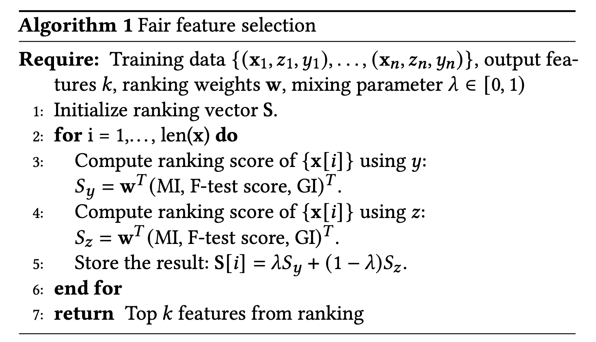

## Reference

- [1] Jones, G. P., Hickey, J. M., Di Stefano, P. G., Dhanjal, C., Stoddart, L. C., & Vasileiou, V. (2020). Metrics and methods for a systematic comparison of fairness-aware machine learning algorithms. [*arXiv preprint arXiv:2010.03986*.](https://arxiv.org/abs/2010.03986v1)
