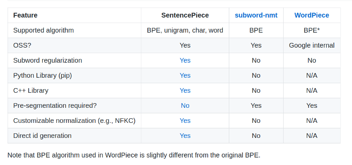
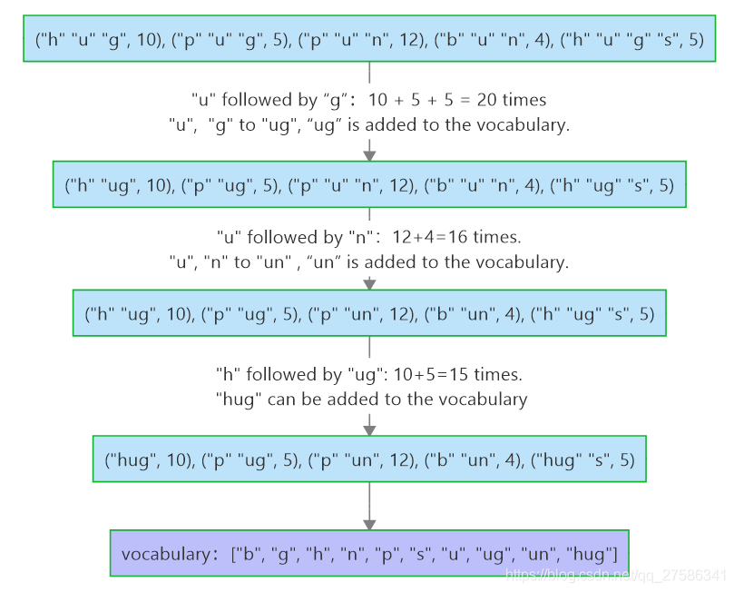
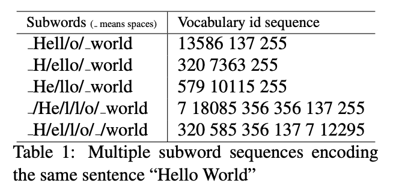

# Sub-word Tokenization & Vocabulary preparation

This note is a summary of sub-word tokenization and vocabulary preparation.

For methodology's details and paper, refer to the associate folder.

文中介绍的分词算法已经全部有成熟的package去实现，不需要我们重造wheel；

了解背后的算法和理念能够帮助我们更好的实施准备和后续工作

## Table of Content

- NMT Structure & Pipeline
  - Why sub-word tokenization
- Language Models:
  - Features/Packages
    - Subword-NMT
    - BertTokenizer
    - SentencePiece
  - Algorithms:
    - BPE
    - Unigram Language Model
    - WordPiece
  - From the user's perspective
    - Usage

## NMT Structure & Pipeline

NMT: Nerual Machine Translation, 引入神经网络的翻译机器。 NMT在翻译领域有较好的表现。

- Transformer
- BERT

**High level Pipeline：**

- Train：
  - prepare text corpus original & target languages
  - Tokenize and encode the text corpus 
  - Desgin and construct (or load pretrained) model
  - feed data set and train

- Usage：
  - tokenize and encode input text in the same way (same tokenizer)
  - use model to generate model result
  - Decode the result and ouput translated text

NMT model不是这篇文章关注的重点，我们重点关注在subword tokenization和相关的算法

tokenizing text: 将text文本转化为words，subwords,然后根据mapping、lookup table转化为ID的过程

- [1] space, punctuation, rule-based
- [2] Subword tokenization
  - Byte-Pair Encoding (BPE)
  - WordPiece
  - SentencePiece

### Why Subword tokenization

什么算是sub-word：举个例子`look, looking, looked, looks`;

当我们有上述一个单词表vocabulary，我们可以将其拆解成`look,##ing,##ed,##s`来表示；

如果不使用sub-word，直接对text corpus进行word-level分词（Space, Punctuation, Rule-based 直观，简单，但是分出来的词典很大），然后选取freq频率top N组成我们的vocab

这种word-level方法带来如下问题：【ref】

- 英语单词总量巨大（17万+），训练中不可能取全部词表来训练，实际应用中还是会可能出现词表中没包含的词（Out of Vocabulary, OOV）
- 低频率词无法得到有效训练
- 衍生词（参考`look`）数量众多，虽然含义相近但是被当做不同词学习，冗余

另一个极端就是character-level tokenization，英文只有26个char，直接拆分到char level虽然解决的vocab size的问题，但是char level拆分也失去了单词的含义。

这个时候Sennrich等人在2016年论文 *Neural machine translation of rare words with subword units* 中引入了Subword的概念和方法

- Subword tokenization是word-level 和 character-level tokenization的混合体。
- Subword tokenization算法基于以下原则
  - 不应将常用词分解为较小的子词，而应将稀有词分解为有意义的子词，
  - 即frequently used words should not be split into smaller subwords, but rare words should be decomposed into meaningful subwords.

参见以下例子

- 德语：Abwasserbehandlungsanlage
- 英语：serage water treatment plant

其中德语`Abwasserbehandlungsanlage`可以拆分成`Abwasser / behandlungs / anlage`分别对应`污水，处理，工厂`

我们既可以把德语`Abwasserbehandlungsanlage`单独作为一个vector放在我们的vocab中`['Abwasser', 'behandlungs', 'anlage','Abwasserbehandlungsanlage']`；

但我们可以使用可变长度的更细粒度的词组合去替代复杂的单词例如`['Abwasser', 'behandlungs', 'anlage']`去表示`Abwasserbehandlungsanlage`

另一个例子

- `['love','loved','loves','loving','hate','hateded','hates','hating' ]`
- `['lov','hat',##e','##ed','#es','##ing']`

Word-level(保留并使用单词去encoding) 的NMT 还存在其他的issues:

- 为了解决OOV（out-of-vocabulary）的问题，使用back-off dict（rare单词和target语言翻译的mapping），但这是基于一个假设即其翻译含义是unambiguous的一一对应，但实践中，语言往往形态多变含义复杂；
- word-level models没有办法翻译或者生产没有见到过unseen的单词（vocab中没有的单词）

Rico Sennrich, Barry Haddow, and Alexandra Birch在其论文[[1]]中的提出的方法中针对NMT的改进：

- 在open-vocabulary情景下，应用subword units方法去替代传统的vocab方法更高效（不再需要large vocab和back-off dict）
- 应用BPE的逻辑去进行分词工作，即使在open-vocabulary情景下，也可以用固定长度fixed-length的vocab去替代（表示）长度可变的文本内容

## Language Models:

### Features/Packages

- Subword-NMT: Rico Sennrich 等人基于BPE算法开发的包
- BertTokenizer/WordPiece: Google为TensorFlow Text开发的包
- SentencePiece: Google开发的集成多种拆解分词算法的Tokenizer工具

**Summary**: 最主要的区别在于对于whitespace的处理，和notation的区别

各自具体prepare vocab的方法有多种（例如BPE）并不是本质上的区别

- compare Subword-nmt， WordPiece & SentencePiece

#### Subword-NMT

#### BertTokenizer/WordPiece

用于BERT的subword分词器
具体准备过程与参考[Google - Tensorflow](https://www.tensorflow.org/text)

#### SentencePiece

[Google SentencePiece Model](https://github.com/google/sentencepiece#train-sentencepiece-model)
区别与WordPiece地方在于

- 是否需要预分词：WordPiece 需要先（通过空格，逗号等）分成words list再进行分词到subword level，sentencePiece可以直接使用sentences作为input
  - google `text.BertTokenizer` 和 `text.WordPieceTokenizer` 都使用了WordPiece的逻辑，
  - 但`text.BertTokenizer`为`text.WordPieceTokenizer`的higher level的interface，可以直接take sentences as input
  - `text.WordPieceTokenizer`只能take words as input
- 适用语言：
  - WordPiece适用于英语等通过标识分割的文本，但并不适合中文日文等基于语义的文本
  - SentencePiece也可适用于英语和中文类文本
  - "This tutorial builds a Wordpiece vocabulary in a top down manner, starting from existing words. This process doesn't work for Japanese, Chinese, or Korean since these languages don't have clear multi-character units. To tokenize these languages conside using `text.SentencepieceTokenizer`, `text.UnicodeCharTokenizer` or [this approach](https://tfhub.dev/google/zh_segmentation/1)."

- 讲解文章：
  - [Medium - Jacky WONG - Understanding SentencePiece ([Under][Standing][_Sentence][Piece])](https://jacky2wong.medium.com/understanding-sentencepiece-under-standing-sentence-piece-ac8da59f6b08)
  - [Deep Learning, NLP, and Representations](https://colah.github.io/posts/2014-07-NLP-RNNs-Representations/)

### Algorithms

#### Byte-Pair Encoding (BPE)

**Vocab准备过程**

- pre-tokenization: 创建unique单词list，并在统计频率
  - `[("hug",10), ("pug",5),("pun",12) ,("bun",4) ,("hugs",5)]`
- create base vocabulary: `['b', 'g', 'h', 'n', 'p', 's', 'u', ]`
  - split based on base-vocabular: `[("h,u,g",10), ("p,u,g",5),("p,u,n",12) ,("b,u,n",4) ,("h,u,g,s",5)]`
  - 计算频率并合并
  
- 停止合并（训练）；合并后的词典vocabulary可以应用于新unseen的单词
  - （前提是没有新增的，未曾见到过的标点符号或者char组合（极少见））

BPE tokenization：greedy longest-match-first strategy ->  [maximum matching](https://tm-town-nlp-resources.s3.amazonaws.com/ch2.pdf) or MaxMatch

#### BPE (WordPiece Variant)

Google的WordPiece在准备Vocab的底层同样使用了BPE的逻辑，不过在BPE的基础上做了些优化。

异同点在于：

- BPE和WordPiece都是初始化Char level的字符然后进行合并merge迭代
  - BPE迭代过程当中合并merge取决于这个pair的出现频率，合并出现频率最高的组合
- WordPiece合并subword取决于一个决策函数：[(Ref#1)]()[(Ref#2)]()
  - 假设subword sequence由 $S = (t_1, t_2, t_3 ... t_n)$ 由n个子词组成
  - $t_i$表示子词，且假设各个子词之间是独立independent存在的
  - 则sequence序列 $S$ 的语言模型似然值等价于所有子词出现概率的乘积
    - $\log(P(S)) = \sum_{i=1}^{n}\log(P(t_i))$
  - 假如把相邻位置的两个词 $x$ 和 $y$ 合并，产生新的字词记为 $z$ ，这时句子 $S$ 的似然值会发生如下变化（增加或者减少）
    - $\log(P(t_z)) - [\log(P(t_x)) + \log(P(t_y))] = \log(\frac{P(t_z)}{P(t_x)P(t_y)})$ 
  - 上述公式实际上就是$x$和$y$之间的互信息，也就是说明subword $x$和$y$在语言模型上有较强的相关性（常以相邻的方式出现）
  - WordPiece据此来决定是否合并merge生成新的subword vocab
- 分词tokenize过程WordPiece和BPE是相同的，本质都是使用greedy longest-match-first strategy ->  [maximum matching](https://tm-town-nlp-resources.s3.amazonaws.com/ch2.pdf) or MaxMatch
  - Google在integrate WordPiece到`BertTokenizer`过程当中还使用了其他方法优化来提升分词效率[(Xinying el al. 2021)](https://arxiv.org/abs/2012.15524v3)

#### Unigram Language Model

BPE虽然解决了准备vocab的问题，但是另一个subword分词的问题并没有解决：即分词对同一个单词，可以有多个不同的分词方式

参见以下例子

Taku Kudo提出了不同的解决思路[(Kudo, 2018)]()

对比BPE&WordPiece，我们能对Unigram有更好的理解：

- Vocab准备
  - BPE/WordPiece从小到大（先char-level, 英文26个字符+标点符号）;
  - Unigram：先准备足够大的词表，根据一个标准不断丢弃不需要的subword直到满足限定条件;
- Tokenization process:
  - BPE/WordPiece: greedy maxmatch，从左到右，匹配最长的possible match，只产生一种分词结果
  - Unigram LM: 产生多个可能的结果，根据概率返回top#1（or top#n）结果

Unigram的Vocab准备和tokenization分词过程相对复杂，详解参见folder和ref

## Reference

- [1] [CSDN - kaiyin_hzau - BPE, WordPiece, SentencePiece](https://blog.csdn.net/qq_27586341/article/details/113424560)
- [2] [CSDN - 满腹的小不甘 - tokenizers in Transformers：BPE、WordPiece，SentencePiece](https://blog.csdn.net/qq_27586341/article/details/113424560)
- [3] [towardsdatascience - Jonathan Kernes - SentencePiece Tokenizer Demystified](https://towardsdatascience.com/sentencepiece-tokenizer-demystified-d0a3aac19b15)
- https://zhuanlan.zhihu.com/p/191648421
- https://www.yanxishe.com/columnDetail/26326