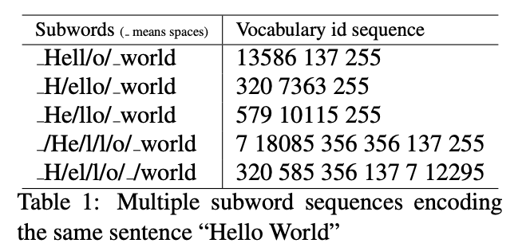

# Unigram Language Model

Subword Regularization: Improving Neural Network Translation Models with Multiple Subword Candidates

BPE的解决了准备Vocab的问题，利用greedy算法，也解决了分词sub-word segmentation的问题。但是BPE的sub-word segmentation使用的是greedy拆分的方法，但在实际当中，一个词对应vocab可能有用不同的subwords对应的多种拆词的选项。

参见下方例子：

Kudo在论文中介绍了一种新的方法来解决上述问题：利用概率论的方法选取最合适的拆分方案

## Subword Segmentation

Unigram LM assume假设：

- vocab中所有的subword occurs independently
- 因此，the probability of a subword sequence$X = (x_1,x_2,x_3...x_M)$等于各个subword出现概率的乘积
  - $P(X) = \prod_{i=1}^{M}p(x_i)$
  - $\forall_{i}x_i\in{V}, \sum_{x\in{V}}=1$
  - 其中V是pre-determined vocabulary
- The most probable segmentation x∗ for the input sentence X is then given by
  - $X^* = \arg_{x\in{S(X)}}\max{P(X)}$
  - where S (X ) is a set of segmentation candidates built from the input sentence X. x∗ is obtained with the Viterbi algorithm (Viterbi, 1967). 其中S(X)是用来拆分X的subword备选项集合，而能够得到最大可能性的X*集合则是通过维特比算法得到的
  - 原始单词表一般巨大，直接去遍历所有可能的组合计算并不科学；[维特比算法](https://zh.wikipedia.org/wiki/%E7%BB%B4%E7%89%B9%E6%AF%94%E7%AE%97%E6%B3%95)是一种动规划算法，此处用来求解序列乘积最大值

## Vocab Preparation

- [Expectation-Maximization最大期望算法](https://en.wikipedia.org/wiki/Expectation%E2%80%93maximization_algorithm)

The vocabulary set $V$ is indeed undertermined at the very beginning and cannot be solved simultaneously with the maximization task. A workaround is to provide a seed vocabulary as the initial (reasonably big enough) vocabulary, and shrink the seed vocabulary during training until a desired vocabulary size is reached.

初始阶段Vocab无法确定，解决方案是先准备一个足够大的vocab，然后慢慢在训练过程中缩小至理想的size；

我们来看看论文中是咋写的：

If the vocabulary V is given, subword occurrence probabilities p(xi) are estimated via the EM algorithm that maximizes the following marginal likelihood L assuming that p(xi) are hidden variables.

如果我们有一个vocab，每个subword出现的概率可以用最大期望算法来通过maximize 以下公式来估计
$$
L = \sum_{s=1}^{|D|}\log({P(X^{(s)})}) = \sum_{s=1}^{|D|}\log({\sum_{x\in{X^{(s)}}}{P(x)}})
$$
如何理解上述公式呢（参考阿北的文章）

- $|D|$表示语料库中的语料数量
- $s$表示一组subword sequence
- $P(x)$表示每个subword在语料text Corpus中的概率
- 综合来看：上述公式直观的理解就是将语料库中所有句子的所有分词组合的概率相加

继续论文：但现实情况更复杂，我们在初始阶段，$V$其实也是不知道的；我们可以通过以下方式去处理；

- 初始阶段先建立一个足够大 的词汇表（可以通过BPE初始化，也可以通过语料库中所有单词+常见subword等）
- 重复迭代以下步骤指导达到理想vocab size
  - 确定本次迭代vocab，用EM算法求解$p(x)$
  - 计算每个subword $x_i$的$loss_i$：删除这个subword之后，likeliehood $L$的下降值
  - 根据$loss_i$ sort我们的subword，保留top n%的单词，同时需要保留single char以防止OOV情况出现

## Reference

- https://www.yanxishe.com/columnDetail/26326
- https://zhuanlan.zhihu.com/p/86965595
- https://zhuanlan.zhihu.com/p/191648421
- https://mp.weixin.qq.com/s?__biz=MzI4MDYzNzg4Mw==&mid=2247520012&idx=3&sn=e92b8d44b747150c7807a37d3b11f70b&chksm=ebb7b7d8dcc03ece601d87476bd43457d4461d649aef8cdfbc61fe955814f243fafcc1cdf80f#rd
- https://everdark.github.io/k9/notebooks/ml/natural_language_understanding/subword_units/subword_units.nb.html#121_expectation-maximization