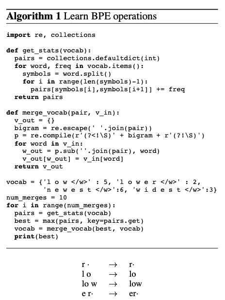

# BPE: Byte Pair Encoding in NMT

## Info

介绍BPE的基本逻辑和在NMT - Neural Machine Translation中的迁移应用；

focus only on BPE，后期基于此方法还发展了WordPiece，SentencePiece等更复杂的应用。参考相关folder和文章


## BPE

- 算法初始由Philip Gage在1994年提出。
- BPE初始提出时候是为了解决数据压缩问题。

- 思想和逻辑：
  - 当数据（文本，字符 etc）中有**重复连续**出现的信息时候，我们可以使用更短的unique的字符来替代相应信息。
  - 更新后得到新的数据，再重复上述步骤，压缩数据直到无法继续压缩。
  - 压缩的过程当中，会得到一张对照表，即原文和替代字符的对照表。我们需要把压缩结果和对照表一同保存。
  - 数据解压过程和压缩过程相反，参考对照表，将替代信息替换成原始信息，重复替换过程直到解压完成。

具体算法参考以下流程

```
# 数据压缩过程
# data to be encoded
aaabdaaadbac

# 'aa'出现频率最高，替换为'Z'(Z=aa)
ZabdZabdac

# 'ab'出现频率最高，替换为'Y'(Y=ab)
ZYdZYdac

# 'ZY'出现频率最高，替换为'X'(X=ZY)

aaabdaaadbac => XdXdac
# 同时输出对照表
X = ZY
Y = ab
Z = aa

# 数据解压过程
X = ZY
XdXdac => ZYdZYdac

Y = ab
ZYdZYdac => ZabdZabdac

Z = aa
ZabdZabdac => aaabdaaabdac
```

## BPE in NMT

NMT: Nerual Machine Translation 在翻译领域有较好的表现。

但是针对不常见的词语翻译表现任然不尽人意。针对NMT model的词汇表通常有3w ~ 5w词汇表长度的限制，尔翻译实际上是一个open-vocabulary的问题，词汇长度不定，会有罕见词汇，新词，没见过的组合词汇等；

例如：

- 中文：污水处理厂
- 德语：Abwasserbehandlungsanlage
- 英语：serage water treatment plant

其中德语`Abwasserbehandlungsanlage`可以拆分成`Abwasser / behandlungs / anlage`分别对应`污水，处理，工厂`

我们既可以把德语`Abwasserbehandlungsanlage`单独作为一个vector放在我们的vocab中`['Abwasser', 'behandlungs', 'anlage','Abwasserbehandlungsanlage']`；

但我们可以使用可变长度的更细粒度的词组合去替代复杂的单词例如`['Abwasser', 'behandlungs', 'anlage']`去表示`Abwasserbehandlungsanlage`

另一个例子

- `['love','loved','loves','loving','hate','hateded','hates','hating' ]`
- `['lov','hat',##e','##ed','#es','##ing']`

Word-level(保留并使用单词去encoding) 的NMT 还存在其他的issues:

- 为了解决OOV（out-of-vocabulary）的问题，使用back-off dict（rare单词和target语言翻译的mapping），但这是基于一个假设即其翻译含义是unambiguous的一一对应，但实践中，语言往往形态多变含义复杂；
- word-level models没有办法翻译或者生产没有见到过unseen的单词（vocab中没有的单词）

Rico Sennrich, Barry Haddow, and Alexandra Birch在其论文[[1]]中的提出的方法中针对NMT的改进：

- 在open-vocabulary情景下，应用subword units方法去替代传统的vocab方法更高效（不再需要large vocab和back-off dict）
- 应用BPE的逻辑去进行分词工作，即使在open-vocabulary情景下，也可以用固定长度fixed-length的vocab去替代（表示）长度可变的文本内容

## BPE in Subword Segmentation

参考BPE算法，but merge most frequent pair of characters；

- 每一个iteration merge 出现频率最高的两个相邻symbol

- iteration的次数是一个超参数hyperparameter

details参见code




## Referance

- [1] Rico Sennrich, Barry Haddow, and Alexandra Birch. 2016. Neural machine translation of rare words with subword units. arXive preprint: [1508.07909v5](https://arxiv.org/abs/1508.07909v5)
- [2] Gage, P. (1994). A new algorithm for data compression. C Users Journal, 12(2), 23-38. [Derczynski Archive Link](https://www.derczynski.com/papers/archive/BPE_Gage.pdf). [pennelynn Archive Link](http://www.pennelynn.com/Documents/CUJ/HTML/94HTML/19940045.HTM)
- [3] Wikimedia Foundation. (2021, March 2). *Byte pair encoding*. BPE: Byte Pair Encoding. Retrieved January 4, 2022, from https://en.wikipedia.org/wiki/Byte_pair_encoding 

